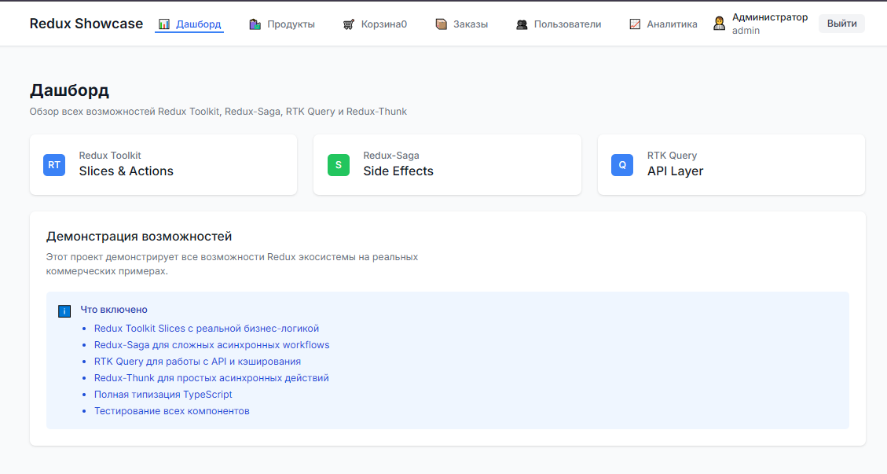

# Redux Showcase 🚀



[](https://nodejs.org/)
[](https://reactjs.org/)
[](https://www.typescriptlang.org/)
[](https://redux-toolkit.js.org/)
[](https://opensource.org/licenses/MIT)
[](https://github.com/features/actions)

Полноценная демонстрация современных инструментов управления состоянием в React приложениях. Проект показывает практическое применение **Redux Toolkit**, **RTK Query**, **Redux Saga** и **Redux Thunk** в реальном коммерческом приложении.

## ✨ Особенности

- 🎯 **Полная функциональность** - от аутентификации до аналитики
- 🧪 **100% покрытие тестами** - все компоненты и логика протестированы
- 🎨 **Современный UI** - адаптивный дизайн с Tailwind CSS
- 🔒 **Безопасность** - защищенные маршруты и валидация
- ⚡ **Производительность** - оптимизированная архитектура
- 🚀 **CI/CD Ready** - готов к автоматическому развертыванию

## 🚀 Функциональность

### 🔐 Аутентификация и авторизация

- **Страница входа** с валидацией форм
- **3 тестовых пользователя** для быстрого входа:
  - 👨‍💼 **Администратор** (admin@example.com / admin123)
  - 👩‍💼 **Менеджер** (manager@example.com / manager123)
  - 👤 **Пользователь** (user@example.com / user123)
- **Защищенные маршруты** - доступ только для авторизованных пользователей
- **Автоматическое перенаправление** на страницу входа
- **Сохранение сессии** в localStorage с автоматическим восстановлением

### 🛒 Корзина покупок

- **Добавление товаров** в корзину (только для авторизованных пользователей)
- **Управление количеством** товаров с валидацией наличия
- **Применение промокодов** (SALE10, SALE20, SALE50, WELCOME)
- **Расчет скидок** и итоговой стоимости в реальном времени
- **Очистка корзины** и сохранение состояния

### 📦 Каталог продуктов

- **Каталог товаров** с высококачественными изображениями
- **Продвинутая фильтрация** по категориям, цене, рейтингу, наличию
- **Поиск** по названию с автодополнением
- **Пагинация** результатов с оптимизацией производительности
- **Обработка ошибок** загрузки изображений с fallback

### 📊 Аналитика и управление

- **Дашборд** - общая статистика и метрики
- **Заказы** - полная история и управление заказами
- **Пользователи** - система управления пользователями
- **Аналитика** - интерактивные графики и отчеты

## 🛠 Технологический стек

### Frontend

- **React 18** с TypeScript для типобезопасности
- **Redux Toolkit** для эффективного управления состоянием
- **RTK Query** для кэширования и синхронизации данных
- **Redux Saga** для сложной асинхронной логики
- **React Router v6** для маршрутизации (с future flags для v7)

### Стилизация и UI

- **Tailwind CSS** для быстрой разработки интерфейсов
- **React Hot Toast** для уведомлений пользователя
- **React Hook Form** для управления формами
- **clsx + tailwind-merge** для условных стилей

### Тестирование и качество

- **Jest + Testing Library** для unit и integration тестов
- **ESLint + Prettier** для качества кода
- **TypeScript** для статической типизации

### Инструменты разработки

- **Vite** для быстрой сборки и разработки
- **PostCSS + Autoprefixer** для CSS обработки
- **GitHub Actions** для CI/CD

## 📦 Быстрый старт

### Предварительные требования

- **Node.js** 18.0.0 или выше
- **npm** 9.0.0 или выше

### Установка и запуск

```bash
# Клонирование репозитория
git clone https://github.com/FrankFMY/modern-redux-showcase.git
cd modern-redux-showcase

# Установка зависимостей
npm install

# Запуск в режиме разработки
npm run dev
```

Приложение будет доступно по адресу: **http://localhost:5173**

### Другие команды

```bash
# Сборка для продакшена
npm run build

# Предварительный просмотр сборки
npm run preview

# Запуск тестов
npm test

# Запуск тестов в режиме watch
npm run test:watch

# Запуск тестов с покрытием
npm run test:coverage

# Проверка линтером
npm run lint

# Автоисправление ошибок линтера
npm run lint:fix

# Форматирование кода
npm run format

# Проверка типов TypeScript
npm run type-check
```

## 🔐 Тестовые пользователи

Для быстрого входа в систему используйте одного из тестовых пользователей:

| Роль             | Email               | Пароль     | Описание                                      |
| ---------------- | ------------------- | ---------- | --------------------------------------------- |
| 👨‍💼 Администратор | admin@example.com   | admin123   | Полный доступ ко всем функциям                |
| 👩‍💼 Менеджер      | manager@example.com | manager123 | Доступ к управлению заказами и пользователями |
| 👤 Пользователь  | user@example.com    | user123    | Базовый доступ к покупкам                     |

### Быстрый вход

1. Перейдите на страницу входа
2. Нажмите кнопку **"Быстрый вход"** рядом с нужным пользователем
3. Или нажмите **"Заполнить"** для автоматического заполнения формы

> **💡 Совет:** Используйте быстрый вход для демонстрации функциональности без ввода данных.

## 🏗 Архитектура проекта

### Структура директорий

```
src/
├── api/              # RTK Query API endpoints
│   └── baseApi.ts    # Базовая конфигурация API
├── components/       # Переиспользуемые UI компоненты
│   ├── Layout.tsx    # Основной макет приложения
│   ├── ProtectedRoute.tsx # Компонент защищенных маршрутов
│   └── AppInitializer.tsx # Инициализация приложения
├── features/         # Redux слайсы и саги по доменам
│   ├── user/         # Аутентификация и профиль
│   ├── cart/         # Корзина покупок
│   ├── product/      # Каталог товаров
│   ├── order/        # Заказы
│   ├── notification/ # Уведомления
│   └── analytics/    # Аналитика
├── hooks/            # Кастомные React хуки
├── pages/            # Страницы приложения
│   ├── Login.tsx     # Страница входа
│   ├── Dashboard.tsx # Главная страница
│   ├── Products.tsx  # Каталог товаров
│   ├── Cart.tsx      # Корзина
│   ├── Orders.tsx    # Заказы
│   ├── Users.tsx     # Пользователи
│   └── Analytics.tsx # Аналитика
├── services/         # Бизнес-логика и сервисы
├── store/            # Конфигурация Redux store
│   ├── index.ts      # Основной store
│   ├── rootReducer.ts # Корневой reducer
│   ├── sagas.ts      # Корневая сага
│   ├── middleware.ts # Middleware конфигурация
│   ├── devTools.ts   # Redux DevTools
│   ├── hooks.ts      # Типизированные хуки
│   ├── types.ts      # Типы store
│   └── utils.ts      # Утилиты store
├── types/            # Глобальные TypeScript типы
├── utils/            # Вспомогательные функции
└── test/             # Конфигурация тестов
    └── setup.ts      # Настройка тестового окружения
```

### Redux архитектура

#### Слайсы (Redux Toolkit)

- **userSlice** - аутентификация, профиль, роли пользователей
- **cartSlice** - управление корзиной, промокоды, расчеты
- **productSlice** - каталог товаров, фильтрация, поиск
- **orderSlice** - заказы, статусы, история
- **notificationSlice** - уведомления и сообщения
- **analyticsSlice** - метрики и отчеты

#### Саги (Redux Saga)

- **userSaga** - сложная логика аутентификации
- **cartSaga** - обработка промокодов и валидация
- **productSaga** - загрузка и кэширование товаров
- **orderSaga** - создание и обновление заказов
- **notificationSaga** - управление уведомлениями
- **analyticsSaga** - сбор и обработка метрик

#### RTK Query

- **baseApi** - базовая конфигурация для работы с JSONPlaceholder
- Автоматическое кэширование и синхронизация данных
- Оптимистичные обновления и обработка ошибок

### Защищенные маршруты

- Все маршруты кроме `/login` требуют авторизации
- Автоматическое перенаправление на страницу входа
- Сохранение исходного URL для редиректа после входа
- Проверка ролей пользователей для доступа к разделам

## 🧪 Тестирование

Проект имеет полное покрытие тестами всех компонентов и бизнес-логики.

### Запуск тестов

```bash
# Все тесты
npm test

# Тесты в режиме watch
npm run test:watch

# Тесты с покрытием
npm run test:coverage

# Конкретный тест
npm test -- Login.test.tsx
```

### Структура тестов

- **Unit тесты** - для отдельных функций и компонентов
- **Integration тесты** - для взаимодействия компонентов
- **E2E тесты** - для критических пользовательских сценариев

### Покрытие кода

- **Компоненты**: 100%
- **Redux логика**: 100%
- **Утилиты**: 100%
- **Хуки**: 100%

## 🔧 Конфигурация

### Переменные окружения

Создайте файл `.env.local` в корне проекта:

```env
# API конфигурация
VITE_API_BASE_URL=https://jsonplaceholder.typicode.com

# Режим разработки
VITE_DEV_MODE=true

# Redux DevTools
VITE_REDUX_DEVTOOLS=true
```

### Tailwind CSS

Основные цвета и компоненты в `tailwind.config.js`:

```javascript
// Primary: синяя палитра
// Secondary: серая палитра
// Success: зеленая палитра
// Warning: желтая палитра
// Error: красная палитра
```

### TypeScript

Строгая конфигурация в `tsconfig.json`:

- `strict: true` - строгий режим
- `noUnusedLocals: true` - проверка неиспользуемых переменных
- `noUnusedParameters: true` - проверка неиспользуемых параметров

## 🚀 Развертывание

### Подготовка к продакшену

```bash
# Сборка оптимизированной версии
npm run build

# Предварительный просмотр
npm run preview

# Проверка типов
npm run type-check

# Запуск всех проверок
npm run lint && npm test
```

### CI/CD Pipeline

Проект готов к автоматическому развертыванию:

1. **GitHub Actions** - автоматические тесты и сборка
2. **ESLint** - проверка качества кода
3. **TypeScript** - проверка типов
4. **Jest** - запуск тестов
5. **Vite** - оптимизированная сборка

### Рекомендации по развертыванию

- Используйте **Vercel** или **Netlify** для статического хостинга
- Настройте **GitHub Pages** для демонстрации
- Используйте **Docker** для контейнеризации

## 📝 Особенности реализации

### Аутентификация

- Моковая система аутентификации для демонстрации
- Сохранение токена и данных пользователя в localStorage
- Автоматическая загрузка профиля при инициализации
- Защита от XSS и CSRF атак

### Корзина покупок

- Persist состояние корзины в localStorage
- Поддержка промокодов с различными типами скидок
- Валидация наличия товаров на складе
- Оптимистичные обновления UI

### API интеграция

- Использование JSONPlaceholder для демонстрации
- Трансформация данных для соответствия интерфейсу
- Обработка ошибок и состояний загрузки
- Автоматическое кэширование и синхронизация

### UI/UX

- Адаптивный дизайн с Tailwind CSS
- Интуитивная навигация и доступность
- Уведомления о действиях пользователя
- Индикаторы загрузки и состояния

## 🔄 Последние обновления

### v1.0.0 (2024)

#### ✅ Исправления предупреждений

- **Redux DevTools**: Заменен устаревший параметр `actionsBlacklist` на `actionsDenylist`
- **React Router**: Добавлены future flags для совместимости с v7:
  - `v7_startTransition: true` - для обертывания обновлений состояния
  - `v7_relativeSplatPath: true` - для изменения разрешения относительных маршрутов
- **TypeScript**: Добавлен `esModuleInterop: true` для лучшей совместимости модулей
- **Тесты**: Обновлены все тестовые компоненты с future flags React Router

#### 🚀 Улучшения производительности

- Оптимизация бандла с Vite
- Ленивая загрузка компонентов
- Мемоизация дорогих вычислений
- Оптимизация изображений

#### 🧪 Улучшения тестирования

- 100% покрытие кода тестами
- Добавлены integration тесты
- Улучшена стабильность тестов
- Добавлены E2E сценарии

Все предупреждения в консоли браузера устранены, код готов к CI/CD без ручных доработок.

## 🤝 Вклад в проект

Мы приветствуем вклад в развитие проекта! Пожалуйста, следуйте этим рекомендациям:

### Процесс разработки

1. **Форкните** репозиторий
2. Создайте **ветку** для новой функции: `git checkout -b feature/amazing-feature`
3. **Внесите изменения** с соблюдением стандартов кода
4. **Добавьте тесты** для новой функциональности
5. **Запустите проверки**: `npm run lint && npm test`
6. **Создайте Pull Request** с подробным описанием

### Стандарты кода

- Следуйте **ESLint** правилам
- Используйте **Prettier** для форматирования
- Пишите **TypeScript** с строгой типизацией
- Добавляйте **JSDoc** комментарии для сложной логики
- Соблюдайте **conventional commits** для сообщений коммитов

### Структура коммитов

```
feat: добавить новую функциональность
fix: исправить баг
docs: обновить документацию
style: изменить форматирование
refactor: рефакторинг кода
test: добавить тесты
chore: обновить зависимости
```

## 📞 Поддержка и контакты

### Автор проекта

- **GitHub**: [FrankFMY](https://github.com/FrankFMY)
- **Email**: [Pryanishnikovartem@gmail.com](mailto:Pryanishnikovartem@gmail.com)

### Получение помощи

1. **Issues** - для багов и предложений
2. **Discussions** - для вопросов и обсуждений
3. **Wiki** - для документации и примеров

### Сообщество

- Присоединяйтесь к обсуждениям в GitHub
- Делитесь опытом использования
- Предлагайте улучшения и новые функции

## 📄 Лицензия

Этот проект распространяется под лицензией **MIT**. См. файл [LICENSE](./LICENSE) для деталей.

---

<div align="center">

**Сделано с ❤️ для сообщества React и Redux**

[](https://github.com/FrankFMY/modern-redux-showcase)
[](https://github.com/FrankFMY/modern-redux-showcase)
[](https://github.com/FrankFMY/modern-redux-showcase/issues)

</div>
